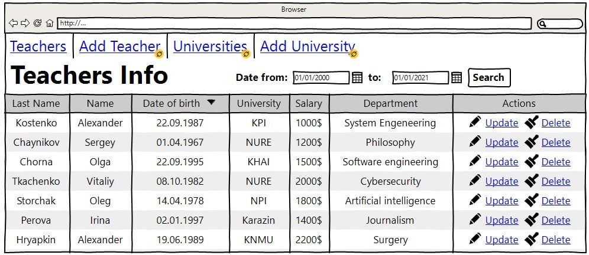
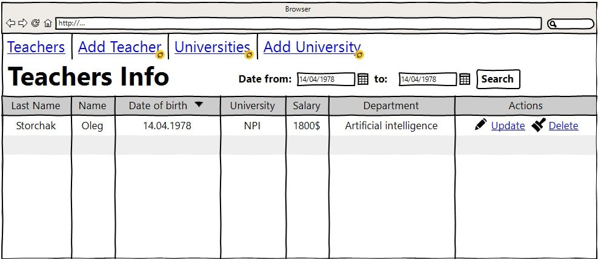
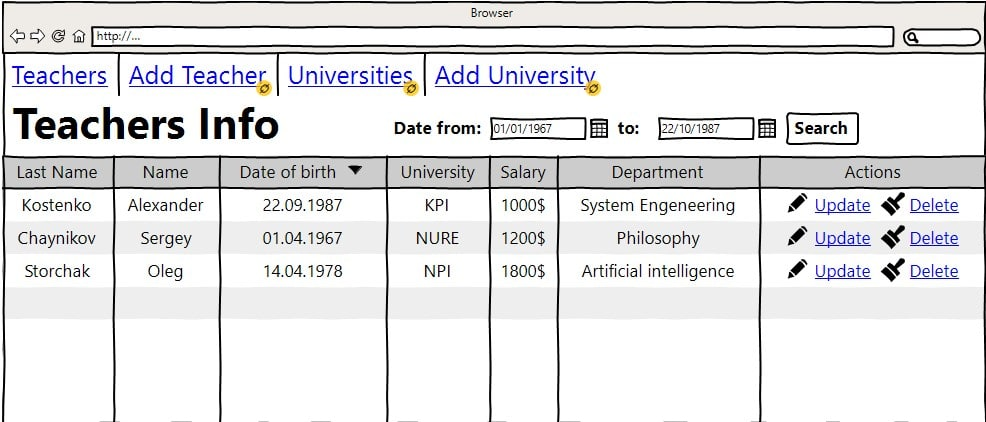
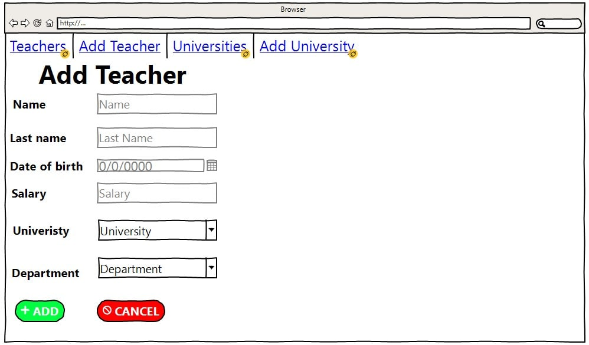
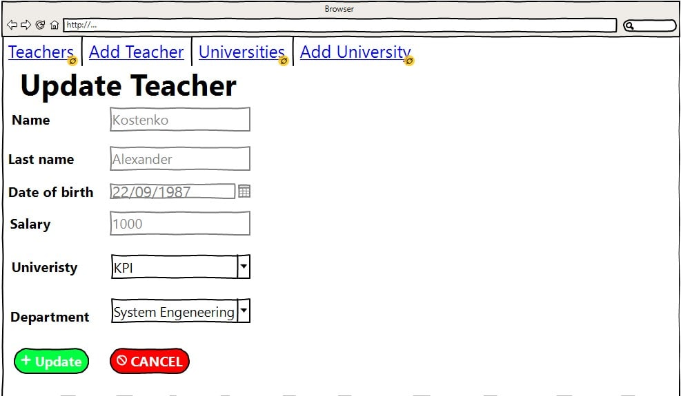
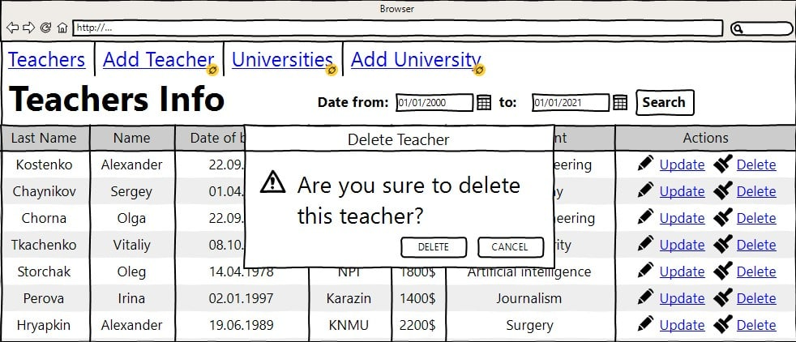
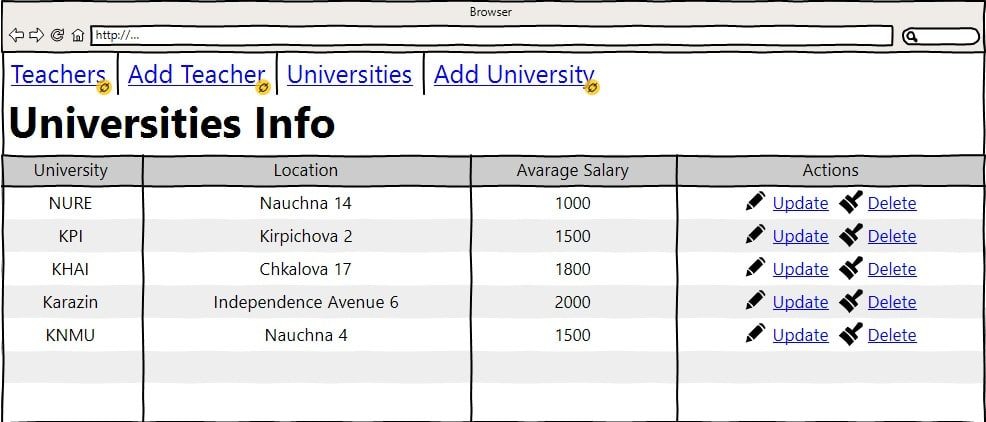
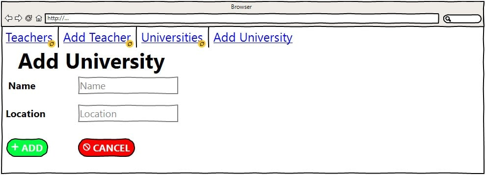
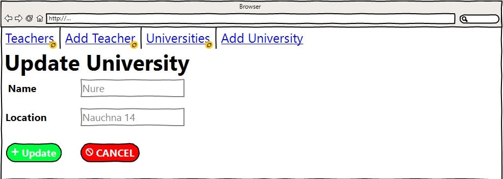
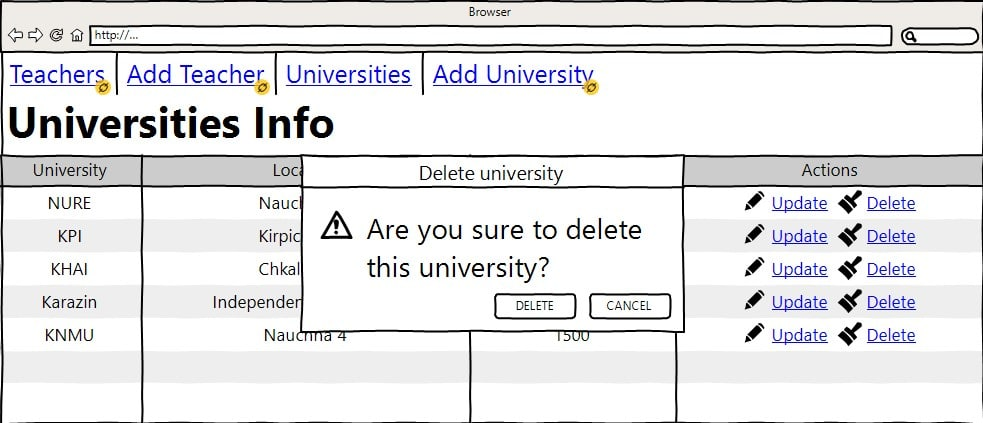

#Managing universities

***

#Visio

"Managing universities" is a web applications that allows to add, 
to edit and to delete information about teachers and universities.

##Application should provide:

+ Storing data in database.
+ Display list of teachers.
  + Filter teachers between selected dates.
  + Filter list of teachers in a certain date.
+ Display list of universities.
+ Update selected teacher.
+ Update selected university.
+ Delete selected teacher.
+ Delete selected university.
+ Add new teacher.
+ Add new University.

## 1. Teachers

## 1.1 Display list of Teachers

The web page is used to see the list of teachers in the whole database.

###Main use

* User clicks on hyperlink "Teachers".
* List of teachers load from database.
* Web page load list of teachers from database.

Picture 1.1.1 View the Teachers list

Web page contains:
+ teacher's name.
+ teacher's last name.
+ teacher's date of birth.
+ teacher's salary.
+ university where he works.
+ department of the university where teacher read lectures.
+ actions with column.

###Filter list of teachers in a certain date

To filter teacher's list on the web page there are two dates "from" and "to". 
User should write "date from" and "date to" with equal dates to get a list of teachers,
who was born in this date.

Picture 1.1.2 Filtering by certain date

###Restriction

+ start date and end date should be the same to filter by a certain date.
+ If start date is blank, it will raise message to fill in start date.
+ If end date is blank, application will consider today's day as an end day.
+ Updating data after pushing button "Select".

###Filter teachers between selected dates

To filter teacher's list on the web page there are two dates "from" and "to". 
User should write "date from" as a start date and second date as an end date.
After pushing button "Select" the web page will be updated. After updating user will see
list of teachers between two dates.

Picture 1.1.3 Filtering by start and end date

###Restriction

+ First date must be lower than end date, otherwise the message with error will appear. 
+ If start date is blank, it will raise message to fill in start date.
+ If end date is blank, application will consider today's day as an end day.

## 1.2 Add new teacher

The web page is used to add new teacher to the database

###Main use

* User click on hyperlink "Add Teacher".
* Web application load the page.
* User enters teacher's name.
* User enters teacher's last name.
* User chooses teacher's date of birth.
* User enters teacher's salary.
* User chooses from dropdown menu teacher's university.
* User chooses from dropdown menu teacher's department.
* User click the button add.
* if user added wrong data the error message will raise. 
* otherwise, user will be redirected to the web page "Teachers".

###Cancel operation scenario

+ User click the button cancel. 
+ New teacher won't be input to the database.
+ input fields will be cleaned.
+ user will be redirected to the 'Teachers' page.

Picture 1.2 Adding new teacher to the database and web page

###Restriction

+ input field name  and last name should contain less than 30 characters.
+ Every input field must be filled.
+ Salary must be a digit.

### Constraints for data validation :

+ Name - (text) maximum length of 30 characters.
+ Last Name - (text) maximum length of 30 characters.
+ Date of birth - (Date) format dd/mm/yyyy.
+ Salary - (int) - minimal salary is 0.
+ University - (enum).
+ Department - (enum).

## 1.3 Update Teacher

The webpage is used to edit the information about a certain teacher

##Main use

* User clicks on hyperlink "edit" in the column 'action' of the teacher he wants to update.
* Web application load the page.
* User edits the input field that he wants.
  * User edits teacher's name.
  * User edits teacher's last name.
  * User chooses another teacher's date of birth.
  * User edits teacher's salary.
  * User chooses another from dropdown menu teacher's university.
  * User chooses another from dropdown menu teacher's department.
* User clicks the button update.
* if user add incorrect data, the error message will raise.
* otherwise, the web application redirect user to the 'Teachers' page. 
* if user doesn't add information and click update, the teacher will contain the same information

###Cancel operation scenario

+ User clicks the button cancel.
+ user's edits won't be input to the database.
+ input fields will be cleaned (if they are filled).
+ user will be redirected to the 'Teachers' page.

Picture 1.3 Updating information about teacher

###Restriction

+ input field name  and last name should contain less than 30 characters.
+ Salary must be a digit.

## 1.4 Delete Teacher

Action is used to delete the teacher from web page list and database

##Main use
+ User click button 'delete' in the column 'action' with a certain teacher.
+ the web application will show the window to confirm the action of the user.
+ if user clicks 'yes' the row will be deleted from the database.
+ "Teachers" page will be reloaded.
+ if user clicks 'no' in the popup window: the window will be closed.

Picture 1.4 Deleting teacher from database and web page

## 2. Universities

## 2.1 Display list of Universities

Web page is used to see the list of universities.

##Main Use

+ User click on hyperlink "Universities".
+ Web application redirect user to the web page "Universities".
+ List of universities load from database.
+ Web page shows list of universities.

Aggregate function: column average salary count as formula: teachers from this university
divided by count of these teachers.

Picture 2.1 View the Universities list

Web page contains:
+ University - university name.
+ Location - university location.
+ Average salary - average salary in university.
+ actions with column.

## 2.2 Add University

The web page is used to add new university to the database

###Main use

* User click on hyperlink "Add University".
* Web application load the page.
* User enters university
* User enters university's location
* User click the button add.
* if user added wrong data the error message will raise. 
* otherwise, user will be redirected to the web page "Universities".

###Cancel operation scenario

+ User click the button cancel. 
+ New university won't be input to the database.
+ input fields will be cleaned.
+ user will be redirected to the 'Unievrsities' page.

Picture 2.2 Adding new university to the database and web page

###Restriction

+ input field name and location must contain less than 50 characters.
+ Every input field must be filled.
+ If there aren't any teachers from this university the average salary will be 0

### Constraints for data validation :

+ Name - (text) maximum length of 50 characters.
+ Location - (text) maximum length of 30 characters.

## 2.3 Update University

The webpage is used to edit the information about a certain university

##Main use

* User clicks on hyperlink "edit" in the column 'action' of the university he wants to update.
* Web application load the page.
* User edits the input field that he wants.
  * User edits university's name.
  * User edits university's location.
* User clicks the button add.
* if user add incorrect data, the error message will raise.
* otherwise, the web application redirect user to the 'Universities' page.  
* if user doesn't add information and click update, the university will contain the same information

###Cancel operation scenario

+ User clicks the button cancel.
+ user's edits won't be input to the database.
+ input fields will be cleaned (if they are filled).
+ user will be redirected to the 'Universities' page.

Picture 2.3 Updating information about university

###Restriction

+ input field name  and location must contain less than 50 characters.

## 2.4 Delete University

Action is used to delete university from web page list and database

##Main use
+ User click button 'delete' in the column 'action' with a certain university.
+ the web application will show the window to confirm the action of the user.
+ if user clicks 'yes' the row will be deleted from the database.
+ "University" page will be reloaded.
+ if user clicks 'no' in the popup window: the window will be closed.

Picture 2.4 Deleting university from database
